# AI SDLC Platform — V1 Technical Architecture Specification

**Document Owner:** Atlas (AI Architect Agent)

**Target Audience:** Orion, Core, Nexus, Sage, Forge, Craft, Pixel, Sentinel, Aegis

**Status:** Approved for V1 Implementation (Updated with Stable Orchestrator Public API Contract)

---

## 1. Executive Summary

This document defines the production-grade V1 architecture for the enterprise **AI-Powered SDLC Automation Platform**.

The platform operates as an orchestrated multi-agent network designed to convert human product requirements into validated, production-ready GitHub Pull Requests, Confluence documentation, and structured SDLC state artifacts. The architecture now formally incorporates a progressive UX design capability: the UX Agent produces a structured UX specification together with lo-fi, mid-fi, and hi-fi visual design artifacts that can be reviewed, approved, versioned, and handed to downstream implementation agents.

### Key Architectural Decisions

- **Human-in-the-Loop (HITL) Priority:** The initiator retains sole decision-making authority over requirements completion and milestone approvals. Agents analyze, recommend, and draft; humans authorize.
- **Hub-and-Spoke Orchestration:** Agents operate under strict isolation. **Direct agent-to-agent communication is forbidden.** The Orchestrator (built on LangGraph by Orion) manages all state transitions, interruptions, and data passing using strict JSON contracts.
- **Stable Public Orchestrator API Boundary:** Orion’s LangGraph graph implementation details, node names, and internal state structures are completely encapsulated behind a versioned, stable public API contract (`v1`). Clients (Core, Pixel, CLI) consume the public API exclusively.
- **Durable File-Based State Machine:** Workflow state is maintained as schema-validated JSON files in `.ai-sdlc/`. Conversational history is ephemeral and treated purely as transport context; file-based state is the single source of truth.
- **Decoupled AI Capability Abstraction:** Agents invoke abstract capabilities (e.g., `ReasoningCapability`, `CodingCapability`, `DesignCapability`) rather than bound vendor APIs. Models are dynamically configurable and hot-swappable across OpenAI, Anthropic, and local/self-hosted instances.
- **Progressive UX Design as a First-Class Artifact:** The UX Agent produces structured UX specifications plus progressive visual design artifacts (lo-fi, mid-fi, hi-fi) that are persisted, versioned, reviewed, and handed to downstream engineering agents as a formal artifact package.
- **Pluggable Visual Design Providers:** Visual design generation is implemented through a provider-agnostic design capability, not by hard-coding model vendors or design applications such as Figma. A Figma integration, if introduced later, is a distinct Nexus-owned provider implementation rather than the default architecture.
- **File-Based Standards Layer for Org/Project Conventions:** Organization- and project-specific conventions (approved libraries, coding style, documentation format, UI/UX libraries, backend architecture, code review format) are captured as git-versioned `instructions.md` + domain-scoped `skills/*.md` files, resolved org → project and injected directly into agent prompts — not retrieved via RAG. Sage's RAG index is reserved for large, unstructured, or fast-changing knowledge (the codebase, Confluence, Jira) that can't be hand-curated into a file. See §9.1.
- **Agent Capability Tiers, Not a Uniform Capability Set:** Agents only get the capability surface their job actually requires — pure reasoning (PO), reasoning plus read-only grounding via RAG (Architecture, Review, Documentation), or reasoning plus isolated write/execute access (the Developer Agent). An agent that only ever judges or advises never receives worktree or command-execution rights. See §8.
- **CLI-First with API Boundary:** V1 delivers a local CLI interfacing directly with the platform engine via a local JSON-RPC / REST contract over IPC/HTTP, guaranteeing full GUI compatibility without refactoring core orchestration logic.

---

## 2. Architecture Diagram

The system follows a tiered layer model separating interface, orchestration boundary, internal orchestration engine, agent isolation, capabilities, tool integration, and storage.

```mermaid
flowchart TD
    %% Clients
    subgraph ClientLayer["1. Client Layer"]
        CLI["CLI Client"]
        GUI["Future Web GUI (Pixel)"]
    end

    %% Engine & Orchestration
    subgraph EngineLayer["2. Engine & Core Platform Layer"]
        API["Platform API / IPC Server (Core)"]
        StateEngine["State & Schema Engine (Core)"]
    end

    subgraph OrchestrationBoundary["3. Orchestrator Public API Boundary (v1)"]
        OrchestratorAPI["Orchestrator Public API Facade"]
    end

    subgraph InternalOrchestration["4. Internal Orchestration Engine (Orion)"]
        LangGraphEngine["LangGraph Engine & Node Runner"]
        Checkpointer["LangGraph Checkpointer / State Sync"]
    end

    %% Agent Isolation Layer
    subgraph AgentLayer["5. Specialist Agent Layer"]
        PO["PO Agent"]
        UX["UX Agent"]
        Arch["Architecture Agent"]
        Dev["Developer Agent (Forge)"]
        Test["Testing Agent"]
        Sec["Security Agent"]
        Doc["Documentation Agent"]
    end

    %% Standards & Convention Context
    subgraph StandardsLayer["Standards & Convention Context Layer (Craft)"]
        StdResolver["Standards Resolver"]
        OrgStd["Org instructions.md / skills/*.md"]
        ProjStd["Project .ai-sdlc/standards/"]
    end

    %% Abstraction & Tooling
    subgraph CapabilityLayer["6. AI Capability Layer"]
        CapEngine["Capability Router & Guardrails"]
        Reasoning["Reasoning Capability"]
        Coding["Coding Capability"]
        Retrieval["Retrieval / RAG Capability (Sage)"]
        Design["Design Capability (pluggable visual design)"]
    end

    subgraph ToolLayer["7. Tool & Integration Layer (Nexus)"]
        MCP["MCP Host Engine"]
        GitTool["Git / GitHub Adapter"]
        JiraTool["Jira Adapter"]
        ConfTool["Confluence Adapter"]
        FSTool["Filesystem & Terminal Adapter"]
    end

    %% Storage & External Systems
    subgraph StorageLayer["8. State & Storage"]
        StateStore[".ai-sdlc/ JSON State Store"]
        ArtifactStore["UX Artifact Store (.ai-sdlc/artifacts/ux)"]
        KnowledgeStore["Vector Store / RAG Index"]
    end

    subgraph ExternalSystems["9. External Systems"]
        GitHubExt["GitHub"]
        JiraExt["Jira"]
        ConfExt["Confluence"]
        LLMExt["AI Model Providers (OpenAI, Anthropic, Bedrock)"]
    end

    %% Communications
    CLI --> API
    GUI -.-> API
    API --> OrchestratorAPI
    OrchestratorAPI --> LangGraphEngine
    LangGraphEngine <--> Checkpointer
    Checkpointer <--> StateEngine
    StateEngine <--> StateStore

    LangGraphEngine <-->|JSON Contract| PO
    LangGraphEngine <-->|JSON Contract| UX
    LangGraphEngine <-->|JSON Contract| Arch
    LangGraphEngine <-->|JSON Contract| Dev
    LangGraphEngine <-->|JSON Contract| Test
    LangGraphEngine <-->|JSON Contract| Sec
    LangGraphEngine <-->|JSON Contract| Doc

    OrgStd --> StdResolver
    ProjStd --> StdResolver
    StdResolver -->|merged instruction context| PO & UX & Arch & Dev & Test & Sec & Doc

    PO & UX & Arch & Dev & Test & Sec & Doc --> CapEngine
    CapEngine --> Reasoning & Coding & Retrieval & Design
    CapEngine <--> LLMExt

    UX --> Design
    Design --> ArtifactStore
    Retrieval <--> KnowledgeStore

    PO & UX & Arch & Dev & Test & Sec & Doc --> MCP
    MCP --> GitTool & JiraTool & ConfTool & FSTool

    GitTool <--> GitHubExt
    JiraTool <--> JiraExt
    ConfTool <--> ConfExt

```



---

## 3. Component Architecture

| Component                            | Purpose                      | Primary Responsibilities                                                                                                                                                                                                      | Inputs                                             | Outputs                                            | Dependencies                 | Owner                      |
| ------------------------------------ | ---------------------------- | ----------------------------------------------------------------------------------------------------------------------------------------------------------------------------------------------------------------------------- | -------------------------------------------------- | -------------------------------------------------- | ---------------------------- | -------------------------- |
| **Orchestrator API Facade**          | Public API Contract Boundary | Exposes strict, versioned facade functions (`start_workflow`, `get_workflow_status`, `submit_clarification`, `submit_approval`, `resume_workflow`, `cancel_workflow`). Decouples external consumers from LangGraph internals. | Standardized Pydantic Request Models               | Standardized Pydantic Response / Error Models      | Core State Engine, Pydantic  | **Orion / Core Interface** |
| **Orchestrator Engine**              | SDLC State Machine           | Manages internal LangGraph nodes, state transitions, human interruptions, retries, and agent invocations.                                                                                                                     | Internal LangGraph commands, agent result payloads | Internal graph mutations, raw state checkpoints    | LangGraph, Core State Engine | **Orion**                  |
| **State & Schema Engine**            | State Integrity              | Manages reading/writing JSON state files, enforcing Pydantic schemas, concurrency locks, and state restoration. It also persists UX artifact manifests and binary design assets inside `.ai-sdlc/` without allowing specialist agents to write files directly. | Raw JSON payloads, file read/write requests        | Schema-validated Pydantic models, JSON state files, UX artifact references | `pydantic`, `filelock`       | **Core**                   |
| **Integration Adapter (MCP Engine)** | External Tool Gateway        | Exposes standardized tools (Git, Jira, Confluence, Filesystem) over Model Context Protocol (MCP) and native adapters. Nexus can also surface provider-specific adapters for visual design services, but the UX contract remains provider-agnostic.                                                                                                         | Tool call requests, integration credentials        | Standardized tool call execution results           | `mcp`, platform credentials  | **Nexus**                  |
| **Design Capability Adapter**        | Pluggable Visual Design Execution | Implements the `DesignCapability` abstraction (`capabilities/design.py`) plus its default/mock provider for the UX Agent, using the same seam-only pattern as `ReasoningCapability`. Real vendor/design-tool providers (including any future Figma provider) are separate implementations behind this seam, built and owned by whoever supplies that integration (e.g. **Nexus** for `integrations/design_provider.py`) — this row is the abstraction itself, not any specific provider. | Design request payloads, provider policy, artifact fidelity needs | Structured design artifacts, artifact metadata, provider response envelopes | Capability Router, provider SDKs | **Craft** |
| **Knowledge Engine**                 | Context Assembly             | Performs hybrid RAG search across codebase, Jira, and Confluence to inject precise context into agent prompts.                                                                                                                | Query strings, semantic context scope              | Context bundles, metadata-attributed code snippets | Vector DB, embedding models  | **Sage**                   |
| **Standards Resolver**               | Org/Project Convention Injection | Resolves and merges `instructions.md` + domain-scoped `skills/*.md` across platform → org → project scope; selects the agent-relevant subset and injects it into prompt assembly.                                          | Org config path, project `.ai-sdlc/standards/`, agent_id | Merged instruction context bundle             | Filesystem, Agent Factory    | **Craft**                  |
| **Developer Runtime**                | Code Generation & Execution  | Owns the Developer Agent end-to-end: assembles the approved spec (requirements + architecture + approved UX package) plus applicable Standards Context into a task, hands it to `CodingCapability`, then takes the resulting change through build/test self-checks, branch push, and PR creation — all inside an isolated working tree, never the initiator's live checkout. See §4 "Developer Agent Contract". | Approved spec package, target repository pointer, Standards Context bundle | Isolated branch + commit(s), self-check results, an opened GitHub PR (only after human approval — see §6 handoff) | `CodingCapability`, Git/GitHub tooling | **Forge**                  |
| **Coding Capability Adapter**        | Pluggable Code-Generation Execution | Implements the `CodingCapability` abstraction (`capabilities/coding.py`) plus its default/mock provider for the Developer Agent, using the same seam-only pattern as `ReasoningCapability`/`DesignCapability`. Real providers — V1's agentic coding-tool SDK harness, and any later provider (e.g. a cloud-hosted coding-agent product with its own remote-trigger-and-poll integration shape) — are separate implementations behind this seam. This row is the abstraction itself, not any specific provider; provider choice is a per-workspace setting captured at `ai-sdlc init` (see §12). | Task/context payload, target working-tree path, allowed-tool/command policy | Structured change summary, self-check results, provider response envelope | Capability Router, provider SDKs | **Forge** |
| **Agent Factory**                    | Specialist Instantiation     | Provides structural base classes and builders to generate specialist SDLC agents (PO, UX, Arch, Sec, Test).                                                                                                                   | Agent config, prompt templates, tools              | Executable specialist agent instances              | Capability Engine, Nexus     | **Craft**                  |
| **Client UI / CLI**                  | Human Interaction Layer      | Renders workflow status, formats artifact diffs, prompts for clarification, and captures milestone approvals via Public API endpoints.                                                                                        | User terminal input, Orchestrator IPC events       | User approval signals, text prompts                | `rich`, `typer`, Async IPC   | **Pixel**                  |
| **Evaluation Engine**                | Quality Gate & Testing       | Assesses agent execution quality, contract compliance, structural outputs, and platform regression suites.                                                                                                                    | Agent invocation logs, output JSONs                | Quality scores, contract pass/fail flags           | `pytest`, evaluation schemas | **Sentinel**               |
| **Security & Policy Guard**          | Policy & Secrets Enforcer    | Validates secret access, sanitizes LLM inputs/outputs against prompt injection, and enforces tool permissions.                                                                                                                | Inbound user prompts, outbound tool calls          | Sanitized payloads, policy decisions               | `pydantic-eval`, regex rules | **Aegis**                  |

---

## 4. Agent Architecture

All agents implement a single uniform abstract base interface. Agents are stateless across invocations; their operational state is entirely passed in via the runtime context and persisted back to `.ai-sdlc/`.

### Base Agent Abstract Interface

```python
from abc import ABC, abstractmethod
from typing import Generic, TypeVar
from pydantic import BaseModel

InSchema = TypeVar("InSchema", bound=BaseModel)
OutSchema = TypeVar("OutSchema", bound=BaseModel)

class AgentResponse(BaseModel, Generic[OutSchema]):
    success: bool
    status_code: str  # e.g., "COMPLETED", "NEEDS_CLARIFICATION", "FAILED"
    data: OutSchema | None = None
    clarification_message: str | None = None
    error_message: str | None = None

class BaseAgent(ABC, Generic[InSchema, OutSchema]):
    agent_id: str
    version: str

    @abstractmethod
    async def execute(self, context: InSchema) -> AgentResponse[OutSchema]:
        """
        Executes the specialist agent logic.
        Read broadly (via tools/context), write narrowly (returns strictly typed output).
        """
        pass

```

### UX Agent Contract (Reconciled with the Shipped UXOutputData)

The shipped Craft UX agent implementation already exposes a tested, working output contract in `src/ai_sdlc/agents/ux/schemas.py` with text-only fields: `flow_title`, `summary`, `user_flows`, `screens`, and `accessibility_considerations`. The architecture preserves this contract by treating any UX visual-design additions as additive, optional fields rather than a breaking replacement.

#### Input Contract (`UXAgentInput`)

```json
{
  "workflow_id": "wf_123456789",
  "initiator": "harshit.bhatt@org.com",
  "requirements": {
    "feature_title": "Order export",
    "summary": "Users need to export their orders to CSV.",
    "functional_requirements": [
      "Export current view as CSV",
      "Show progress indicator while export runs"
    ]
  },
  "project_context": {
    "repository_name": "order-service",
    "detected_tech_stack": ["TypeScript", "React"]
  },
  "architecture_context": {
    "screen_candidates": ["OrdersPage", "ExportDialog"],
    "navigation_notes": ["Export is available from the orders toolbar"]
  },
  "previous_designs": []
}
```

#### Output Contract (`UXAgentOutput`)

```json
{
  "success": true,
  "status_code": "COMPLETED",
  "data": {
    "flow_title": "Export orders to CSV",
    "summary": "Users can export their current order list to CSV from the Orders page.",
    "user_flows": [
      "User opens the Orders page and clicks Export",
      "The system shows progress, then downloads the export file"
    ],
    "screens": [
      "OrdersPage",
      "ExportDialog",
      "ExportSuccessState"
    ],
    "accessibility_considerations": [
      "Export action must be keyboard reachable",
      "Progress and success states must be announced to assistive technology"
    ],
    "ux_specification": {
      "user_personas": ["Operations Manager"],
      "navigation": [{"from": "OrdersPage", "to": "ExportDialog"}],
      "components": ["Export button", "Progress indicator", "Success toast"],
      "states": ["loading", "empty", "success", "error"],
      "validation": ["Export file name must be human-readable"]
    },
    "visual_designs": {
      "lo_fi": [
        {
          "artifact_id": "ux-art-001",
          "fidelity": "LO_FI",
          "status": "DRAFT",
          "screen_refs": ["OrdersPage"],
          "artifact_ref": ".ai-sdlc/artifacts/ux/ux-art-001/payload.png",
          "mime_type": "image/png"
        }
      ],
      "mid_fi": [],
      "hi_fi": []
    },
    "design_package_status": "DRAFT"
  },
  "clarification_message": null,
  "error_message": null
}
```

The additive fields are optional. Existing consumers that ignore them continue to work because the original shipped schema remains valid. If a future implementation requires a breaking change to the shipped contract, it must be treated as a migration event and explicitly documented.

### Developer Agent Contract (Forge)

#### Scope

The Developer Agent's job is exactly one thing: **turn an already-approved spec into a real, isolated, self-checked code change in the target codebase, ready for a human to review.** Everything upstream of "the spec is approved" and everything downstream of "a human reviews the result" belongs to something else already built or already scoped:

- It does not produce the requirements, architecture, or design — PO/Architecture/UX (existing Craft agents) already did, and the Developer Agent only ever receives their approved output (see "UX → Developer Agent Handoff Contract" in §6, which this section extends).
- It does not establish which repository it's working against — the target repository path is already captured once, at `ai-sdlc init` (§12), the same way it is for every other agent.
- It does not build a new approval mechanism — it reuses the Orchestrator's existing `WAITING_FOR_APPROVAL` / `submit_approval` gate verbatim, the same one UX artifacts already use (§6, "UX Revision & Feedback Loop"). Nothing it produces takes effect on the initiator's real working directory until that gate is cleared.
- It does perform a first pass of self-checking — running the codebase's own existing build/test commands as part of its own loop, to catch obvious breakage before presenting anything. It does not do independent quality assurance: authoring new tests, judging coverage, or deeper review is the (not yet built) Testing/Review Agents' job, running as a later stage.

#### Execution Model

The Developer Agent does not implement its own code-generation or code-execution engine. It calls `CodingCapability` (§8), which delegates to a pluggable provider — an existing agentic coding tool, harnessed programmatically rather than rebuilt. V1's provider drives that tool in a fully unattended permission mode (no per-edit prompts), scoped to:

1. **An isolated working tree** — a disposable Git worktree/branch created off the target repository, never the initiator's live checkout. All file edits and command execution happen only here.
2. **An explicit tool/command allow-list** — mirroring §10's existing sandboxing requirement (`git`, `mvn`, `gradle`, `npm`, `pytest`, ...); anything outside the allow-list is denied outright, not prompted.

Once the provider finishes (or exhausts its retry/step budget), the Developer Agent runs the target codebase's own build/test commands as a self-check, then packages the diff as a pending artifact and requests approval through the existing mechanism — it does not push a branch or open a PR until that approval is granted. On approval, it pushes the isolated branch and opens the PR (the platform's stated end product, per §1) — this is a real PR a human merges through normal GitHub review, never a silent local merge. On rejection, the same revision-loop pattern UX already uses applies: the feedback is threaded back in as an additional input, and the Developer Agent produces a new attempt.

Provider choice (which agentic coding tool backs `CodingCapability` for a given workspace) is a setting captured once at `ai-sdlc init`, not re-asked per workflow — see §12's `--coding-provider` option and §20's resolved Copilot-integration question.

#### Input Contract (`DeveloperAgentInput`)

```json
{
  "workflow_id": "wf_123456789",
  "initiator": "harshit.bhatt@org.com",
  "requirements": {
    "feature_title": "Redis Cache Integration for Order Service",
    "functional_requirements": ["..."],
    "non_functional_requirements": ["..."],
    "acceptance_criteria": ["..."]
  },
  "architecture_context": {
    "tech_stack": ["Java", "Spring Boot", "Gradle"],
    "components_affected": ["OrderService", "OrderCacheConfig"]
  },
  "ux_artifact_package": {
    "ux_specification": { "...": "as defined in §6's UX → Developer Agent Handoff Contract" },
    "approved_artifacts": ["..."],
    "design_package_status": "APPROVED"
  },
  "target_repository": {
    "workspace_path": "/abs/path/to/order-service",
    "base_branch": "main"
  },
  "standards_context": {
    "instructions": "...merged org → project instructions.md content...",
    "skills": ["backend-architecture.md"]
  },
  "coding_provider": "configured at ai-sdlc init, not chosen per-call"
}
```

`ux_artifact_package` is omitted (not empty) for workflows where UX design was not required for the given change; `requirements`/`architecture_context` are always present, threaded forward the same way Architecture/UX already receive PO's output today.

#### Output Contract (`DeveloperAgentOutput`)

```json
{
  "success": true,
  "status_code": "NEEDS_APPROVAL",
  "data": {
    "branch_name": "forge/redis-cache-integration-wf123456789",
    "files_changed": ["src/main/java/.../OrderCacheConfig.java", "src/main/java/.../OrderService.java"],
    "self_check": {
      "build_passed": true,
      "tests_passed": true,
      "commands_run": ["./gradlew build", "./gradlew test"]
    },
    "pull_request": null
  },
  "clarification_message": null,
  "error_message": null
}
```

`pull_request` is populated (`{"url": "...", "number": 42}`) only after the pending change is approved and the Developer Agent has actually pushed the branch and opened it — never before, matching the "does not push/open until approved" rule above.

### Agent Contract Example (PO Agent)

#### Input Contract (`POAgentInput`)

```json
{
  "workflow_id": "wf_123456789",
  "initiator": "harshit.bhatt@org.com",
  "raw_requirement": "Add support for Redis caching to our order service to reduce DB load under high traffic.",
  "project_context": {
    "repository_name": "order-service",
    "detected_tech_stack": ["Java", "Spring Boot", "Gradle"]
  },
  "previous_clarifications": []
}
```

#### Output Contract (`POAgentOutput`)

```json
{
  "success": true,
  "status_code": "COMPLETED",
  "data": {
    "feature_title": "Redis Cache Integration for Order Service",
    "summary": "Implement Redis-backed caching for order retrieval endpoints to drop database query latencies.",
    "functional_requirements": [
      "Cache 'GET /orders/{id}' responses in Redis with a configurable TTL (default 15 mins).",
      "Evict or update cache automatically upon 'PUT /orders/{id}' updates."
    ],
    "non_functional_requirements": [
      "Order retrieval response time under 50ms for cached hits.",
      "Graceful fallback to SQL database if Redis cluster is unreachable."
    ],
    "out_of_scope": [
      "Distributed session management",
      "Caching for user profile service"
    ],
    "acceptance_criteria": [
      "Cache hit ratio verified via metrics endpoint.",
      "Unit and integration tests pass with Redis embedded container."
    ]
  },
  "clarification_message": null,
  "error_message": null
}
```

---

## 5. Orchestrator Architecture & Public API Contract

### 5.1 Public vs. Internal Boundaries

To ensure Orion's internal implementation choices (LangGraph node structure, `Command(resume=...)` semantics, internal checkpoints) can evolve without breaking consumer services, Orion exports a strict **Public Orchestrator API Service Contract**.

```
┌─────────────────────────────────────────────────────────┐
│              Consumers (Core, Pixel, CLI)               │
└────────────────────────────┬────────────────────────────┘
                             │
                             ▼  [Public API Contract: v1]
┌─────────────────────────────────────────────────────────┐
│             Orchestrator Public API Facade              │
│ - start_workflow()       - submit_approval()            │
│ - get_workflow_status()  - resume_workflow()            │
│ - submit_clarification() - cancel_workflow()            │
└────────────────────────────┬────────────────────────────┘
                             │
                             ▼  [Internal Boundary]
┌─────────────────────────────────────────────────────────┐
│            Orion Internal Orchestration                 │
│ - LangGraph Graph Definition & State Sync               │
│ - Node Transitions & Conditional Routing Engine         │
│ - Checkpointer Mapping & Interrupt Command Translations │
└─────────────────────────────────────────────────────────┘

```

- **Public Boundary:** Consumers interact strictly with the Python interface or HTTP REST/IPC endpoints exposing `v1` schemas. Consumers never inspect LangGraph graph instances, node names, or internal execution frames directly.
- **Internal Boundary:** LangGraph state keys, raw node exceptions, memory checkpointers, and direct graph node handlers remain strictly private to Orion.

---

### 5.2 Public Orchestrator API Specification (`v1`)

#### Common API Data Models & Error Enums

```python
from enum import Enum
from typing import Generic, TypeVar, Optional, List, Dict, Any
from pydantic import BaseModel, Field
from datetime import datetime

T = TypeVar("T")

class WorkflowPhase(str, Enum):
    INIT = "INIT"
    REQUIREMENTS = "REQUIREMENTS"
    UX_DESIGN = "UX_DESIGN"
    ARCHITECTURE = "ARCHITECTURE"
    DEVELOPMENT = "DEVELOPMENT"
    TESTING = "TESTING"
    SECURITY = "SECURITY"
    CODE_REVIEW = "CODE_REVIEW"
    DOCUMENTATION = "DOCUMENTATION"
    PULL_REQUEST = "PULL_REQUEST"
    COMPLETED = "COMPLETED"
    FAILED = "FAILED"
    CANCELLED = "CANCELLED"

# NOTE: `UX_DESIGN` is part of the public workflow vocabulary for future graph
# expansion, but the current Orion runtime still uses a free-string stage model
# and does not yet execute a live UX_DESIGN node. The architecture therefore
# treats UX_DESIGN as an aspirational/doc-only phase until the orchestrator is
# extended to execute it.

class WorkflowStatusType(str, Enum):
    RUNNING = "RUNNING"
    WAITING_FOR_CLARIFICATION = "WAITING_FOR_CLARIFICATION"
    WAITING_FOR_APPROVAL = "WAITING_FOR_APPROVAL"
    COMPLETED = "COMPLETED"
    FAILED = "FAILED"
    CANCELLED = "CANCELLED"

class ErrorCode(str, Enum):
    WORKFLOW_NOT_FOUND = "WORKFLOW_NOT_FOUND"
    INVALID_STATE_TRANSITION = "INVALID_STATE_TRANSITION"
    VALIDATION_ERROR = "VALIDATION_ERROR"
    UNAUTHORIZED_INITIATOR = "UNAUTHORIZED_INITIATOR"
    INTERNAL_ORCHESTRATION_ERROR = "INTERNAL_ORCHESTRATION_ERROR"
    LOCK_ACQUISITION_FAILED = "LOCK_ACQUISITION_FAILED"

class APIErrorDetail(BaseModel):
    code: ErrorCode
    message: str
    details: Optional[Dict[str, Any]] = None
    timestamp: datetime = Field(default_factory=datetime.utcnow)

class APIResponse(BaseModel, Generic[T]):
    api_version: str = "v1"
    success: bool
    data: Optional[T] = None
    error: Optional[APIErrorDetail] = None

```

---

#### 1. `start_workflow()`

**Purpose:** Initializes a new SDLC workflow instance, sets up file-based state tracing, and executes the initial workflow node.

- **Request Schema (`StartWorkflowRequest`):**

```python
class StartWorkflowRequest(BaseModel):
    initiator_id: str = Field(..., description="Email/ID of the user initiating the workflow.")
    raw_requirement: str = Field(..., min_length=10, description="Initial requirement text.")
    project_context: Dict[str, Any] = Field(default_factory=dict, description="Metadata regarding repo and stack.")

```

- **Response Schema (`StartWorkflowData`):**

```python
class StartWorkflowData(BaseModel):
    workflow_id: str
    initiator_id: str
    current_phase: WorkflowPhase
    status: WorkflowStatusType
    created_at: datetime

```

- **Error Scenarios:**
- `VALIDATION_ERROR`: Empty requirement or invalid initiator format.
- `LOCK_ACQUISITION_FAILED`: Workspace state lock contention during initialization.

---

#### 2. `get_workflow_status()`

**Purpose:** Retrieves the current public status, phase execution tree, active interrupts, and available artifact references for a given workflow.

- **Request Schema (`GetWorkflowStatusRequest`):**

```python
class GetWorkflowStatusRequest(BaseModel):
    workflow_id: str

```

- **Response Schema (`WorkflowStatusData`):**

```python
class PendingAction(BaseModel):
    action_type: str  # "CLARIFICATION" or "APPROVAL"
    prompt_message: str
    target_phase: WorkflowPhase
    payload_artifact_path: Optional[str] = None  # e.g., ".ai-sdlc/requirements.json"

class WorkflowStatusData(BaseModel):
    workflow_id: str
    initiator_id: str
    current_phase: WorkflowPhase
    status: WorkflowStatusType
    pending_action: Optional[PendingAction] = None
    updated_at: datetime
    artifacts: Dict[str, str]  # Maps artifact key -> relative file path

```

- **Error Scenarios:**
- `WORKFLOW_NOT_FOUND`: Workflow ID does not map to an existing state file.

---

#### 3. `submit_clarification()`

**Purpose:** Submits human answers to an active clarification question raised by an agent.

- **Request Schema (`SubmitClarificationRequest`):**

```python
class SubmitClarificationRequest(BaseModel):
    workflow_id: str
    initiator_id: str
    response_text: str = Field(..., min_length=1, description="Answer provided by the initiator.")

```

- **Response Schema (`SubmitClarificationData`):**

```python
class SubmitClarificationData(BaseModel):
    workflow_id: str
    current_phase: WorkflowPhase
    status: WorkflowStatusType
    message: str = "Clarification accepted. Workflow resuming."

```

- **Error Scenarios:**
- `UNAUTHORIZED_INITIATOR`: `initiator_id` does not match the workflow owner.
- `INVALID_STATE_TRANSITION`: Workflow is not in `WAITING_FOR_CLARIFICATION` state.

---

#### 4. `submit_approval()`

**Purpose:** Records explicit human decision (Approval or Rejection) for major SDLC milestone phase transitions.

- **Request Schema (`SubmitApprovalRequest`):**

```python
class SubmitApprovalRequest(BaseModel):
    workflow_id: str
    initiator_id: str
    approved: bool
    feedback: Optional[str] = Field(None, description="Mandatory reason if approved=False.")

```

- **Response Schema (`SubmitApprovalData`):**

```python
class SubmitApprovalData(BaseModel):
    workflow_id: str
    current_phase: WorkflowPhase
    status: WorkflowStatusType
    message: str

```

- **Error Scenarios:**
- `INVALID_STATE_TRANSITION`: Workflow is not in `WAITING_FOR_APPROVAL` state.
- `VALIDATION_ERROR`: Rejection submitted without explanatory feedback.

---

#### 5. `resume_workflow()`

**Purpose:** Resumes workflow execution following an explicit pause or system interruption (e.g., transient agent retry pause).

- **Request Schema (`ResumeWorkflowRequest`):**

```python
class ResumeWorkflowRequest(BaseModel):
    workflow_id: str
    initiator_id: str

```

- **Response Schema (`ResumeWorkflowData`):**

```python
class ResumeWorkflowData(BaseModel):
    workflow_id: str
    current_phase: WorkflowPhase
    status: WorkflowStatusType

```

- **Error Scenarios:**
- `INVALID_STATE_TRANSITION`: Workflow is already actively running or in terminal state (`COMPLETED`, `CANCELLED`).

---

#### 6. `cancel_workflow()`

**Purpose:** Aborts workflow execution immediately, transitions status to `CANCELLED`, and releases state locks.

- **Request Schema (`CancelWorkflowRequest`):**

```python
class CancelWorkflowRequest(BaseModel):
    workflow_id: str
    initiator_id: str
    reason: str

```

- **Response Schema (`CancelWorkflowData`):**

```python
class CancelWorkflowData(BaseModel):
    workflow_id: str
    status: WorkflowStatusType = WorkflowStatusType.CANCELLED
    cancelled_at: datetime

```

- **Error Scenarios:**
- `UNAUTHORIZED_INITIATOR`: Request submitted by user other than workflow initiator.
- `INVALID_STATE_TRANSITION`: Workflow is already in terminal state.

---

### 5.3 Public API Versioning Strategy

1. **Namespace isolation:** All API routes, Pydantic contracts, and RPC interfaces are strictly version-prefixed (`v1`).
2. **Backward Compatibility Guarantee:** Non-breaking field additions (optional fields) are permitted in minor updates. Breaking changes (removing fields, changing enum names) mandate bumping the route prefix to `v2`.
3. **Internal Decoupling:** Orion may refactor LangGraph state schemas, node graph topologies, or node implementation logic arbitrarily without bumping `v1`, provided all responses returned through the public facade conform strictly to the specified `APIResponse[T]` contracts.

---

## 6. State Architecture

State is decoupled from conversation history. The durable single source of truth is stored in `.ai-sdlc/` as JSON files conforming to Pydantic schemas managed by **Core**.

### State Directory Layout

```
.ai-sdlc/
├── workflow.json         # Orchestrator execution state & history
├── requirements.json     # PO Agent state
├── ux.json               # UX Agent state (structured UX spec + artifact manifest)
├── architecture.json     # Technical Architecture Agent state
├── implementation.json   # Developer Agent state (changed files, patches)
├── testing.json          # Test suites and execution results
├── security.json         # Security audit & SAST scan results
├── pr.json               # Final Pull Request payload and links
└── artifacts/
    └── ux/               # Persisted UX design artifacts and their binary payloads
        └── {artifact_id}/
            ├── metadata.json
            └── payload.*

```

### UX Artifact Persistence Model

UX design artifacts are not written by specialist agents. Instead, the UX Agent returns a structured result containing artifact references and metadata. The Orchestrator/Core persist those artifacts durably in `.ai-sdlc/artifacts/ux/` and update `ux.json` to reference them. This keeps the agent stateless while preserving durable artifact storage for downstream handoff.

Each artifact entry stores:

- `artifact_id`: stable identifier for the design artifact.
- `fidelity`: `LO_FI`, `MID_FI`, or `HI_FI`.
- `version`: monotonic revision number.
- `status`: `DRAFT`, `APPROVED`, `REJECTED`, `SUPERSEDED`.
- `screen_refs` / `flow_refs`: identifiers linking the artifact to a screen/flow/spec block.
- `artifact_ref`: relative path to the persisted payload in `.ai-sdlc/artifacts/ux/`.
- `mime_type`: content type (`image/png`, `application/json`, etc.).
- `parent_artifact_id`: optional pointer to the previous revision for history.

The artifact manifest in `ux.json` is the authoritative pointer list; the files in `.ai-sdlc/artifacts/ux/` are the durable payloads.

### UX Revision & Feedback Loop

Rejection and revision reuse the Orchestrator's existing, already-implemented approval mechanism rather than introducing a UX-specific one: `submit_approval(approved=false, feedback="...")` (Public API) → `Orchestrator.resume_workflow_after_approval(..., decision="rejected", feedback=...)` (`src/ai_sdlc/orchestration/orchestrator.py`, real code today). This is the same code path PO/Architecture approvals already use.

For a UX artifact specifically:

1. A human rejects a `DRAFT`/`IN_REVIEW` artifact via the standard approval endpoint, supplying `feedback`. The artifact's `status` becomes `REJECTED`; it is never mutated or deleted.
2. The Orchestrator re-invokes the UX Agent for the same stage, passing the reviewer's `feedback` forward as an additional input field (`request.inputs["revision_feedback"]`), alongside the original `requirements`/`architecture_context` — the same "merge accumulated `wf.inputs` into the next request" mechanism `invoke_agent_for_stage` already uses for clarification answers.
3. The UX Agent produces a new artifact version at the same or a higher fidelity level, with `parent_artifact_id` pointing at the rejected artifact, `version` incremented, and `status` starting at `DRAFT` again.
4. Once a human approves an artifact, its `status` becomes `APPROVED` and it is treated as immutable; any further change is a new artifact version with a new `parent_artifact_id`, never an in-place edit of an approved payload (see "Visual Artifact Drift" risk below).

Approval granularity (per-fidelity-level vs. one final approval) is intentionally left open — see Open Questions.

### UX → Developer Agent Handoff Contract

The Developer Agent does not receive the full `ux.json` artifact history — only the subset that has cleared human review, so it can never build against a draft or rejected design by mistake:

```text
UX Artifact Package (constructed by Core from ux.json, passed to the Developer Agent)
├── ux_specification            # the `ux_specification` object from ux.json, as-is
├── approved_artifacts[]        # only artifacts with status == "APPROVED", highest version per screen/flow
│   ├── artifact_id
│   ├── fidelity                # typically HI_FI, but whatever fidelity was actually approved
│   ├── screen_refs / flow_refs
│   ├── artifact_ref            # path into .ai-sdlc/artifacts/ux/
│   └── mime_type
└── design_package_status       # must equal "APPROVED" for this package to be handed off at all
```

If `design_package_status` is not `APPROVED`, Core does not construct or hand off a package — the Developer Agent stage cannot begin. This mirrors the existing rule that the Orchestrator only advances past a `WAITING_FOR_APPROVAL` stage once a decision is recorded, not before.

This UX package is combined with `requirements`/`architecture` — already threaded forward automatically via `wf.inputs`, the same mechanism that already gives the Architecture and UX Agents each other's prior output — plus the applicable Standards Context bundle (§9.1), into the full `DeveloperAgentInput` described in §4's "Developer Agent Contract". Not every workflow requires a UX design; when it doesn't, `ux_artifact_package` is simply absent from that input rather than blocking the Developer Agent stage.

The Developer Agent's *own* output goes through the identical approval gate a second time, for a different artifact: not a design, but the actual code change itself (a branch + diff, self-checked against the codebase's own build/tests). See §4's "Execution Model" for why nothing is pushed or opened as a PR until that second approval clears.

### Primary Schemas

#### 1. `workflow.json` Schema

```json
{
  "$schema": "https://json-schema.org/draft/2020-12/schema",
  "type": "object",
  "properties": {
    "workflow_id": { "type": "string" },
    "created_at": { "type": "string", "format": "date-time" },
    "updated_at": { "type": "string", "format": "date-time" },
    "current_phase": {
      "type": "string",
      "enum": [
        "INIT",
        "REQUIREMENTS",
        "UX_DESIGN",
        "ARCHITECTURE",
        "DEVELOPMENT",
        "TESTING",
        "SECURITY",
        "CODE_REVIEW",
        "DOCUMENTATION",
        "PULL_REQUEST",
        "COMPLETED",
        "FAILED",
        "CANCELLED"
      ]
    },
    "initiator": { "type": "string" },
    "active_interrupt": {
      "type": ["object", "null"],
      "properties": {
        "reason": {
          "type": "string",
          "enum": ["CLARIFICATION", "MILESTONE_APPROVAL"]
        },
        "message": { "type": "string" },
        "timestamp": { "type": "string", "format": "date-time" }
      }
    }
  },
  "required": [
    "workflow_id",
    "created_at",
    "updated_at",
    "current_phase",
    "initiator"
  ]
}
```

#### 2. `requirements.json` Schema

```json
{
  "$schema": "https://json-schema.org/draft/2020-12/schema",
  "type": "object",
  "properties": {
    "version": { "type": "integer" },
    "approved_by_initiator": { "type": "boolean" },
    "feature_name": { "type": "string" },
    "user_stories": {
      "type": "array",
      "items": {
        "type": "object",
        "properties": {
          "id": { "type": "string" },
          "story": { "type": "string" },
          "acceptance_criteria": {
            "type": "array",
            "items": { "type": "string" }
          }
        },
        "required": ["id", "story", "acceptance_criteria"]
      }
    }
  },
  "required": [
    "version",
    "approved_by_initiator",
    "feature_name",
    "user_stories"
  ]
}
```

#### 3. `ux.json` Schema

```json
{
  "$schema": "https://json-schema.org/draft/2020-12/schema",
  "type": "object",
  "properties": {
    "version": { "type": "integer" },
    "workflow_id": { "type": "string" },
    "design_package_status": {
      "type": "string",
      "enum": ["DRAFT", "IN_REVIEW", "APPROVED", "REJECTED", "SUPERSEDED"]
    },
    "current_fidelity": {
      "type": "string",
      "enum": ["LO_FI", "MID_FI", "HI_FI"]
    },
    "ux_specification": { "type": "object" },
    "artifacts": {
      "type": "array",
      "items": {
        "type": "object",
        "properties": {
          "artifact_id": { "type": "string" },
          "fidelity": { "type": "string" },
          "version": { "type": "integer" },
          "status": { "type": "string" },
          "screen_refs": { "type": "array", "items": { "type": "string" } },
          "flow_refs": { "type": "array", "items": { "type": "string" } },
          "artifact_ref": { "type": "string" },
          "mime_type": { "type": "string" },
          "parent_artifact_id": { "type": ["string", "null"] }
        },
        "required": ["artifact_id", "fidelity", "version", "status", "artifact_ref"]
      }
    }
  },
  "required": ["version", "workflow_id", "design_package_status", "ux_specification"]
}
```

#### 4. `architecture.json` Schema

```json
{
  "$schema": "https://json-schema.org/draft/2020-12/schema",
  "type": "object",
  "properties": {
    "approved": { "type": "boolean" },
    "target_stack": {
      "type": "object",
      "properties": {
        "language": { "type": "string" },
        "framework": { "type": "string" },
        "build_tool": { "type": "string" }
      },
      "required": ["language", "framework", "build_tool"]
    },
    "component_changes": {
      "type": "array",
      "items": {
        "type": "object",
        "properties": {
          "component": { "type": "string" },
          "action": {
            "type": "string",
            "enum": ["MODIFY", "CREATE", "DELETE"]
          },
          "description": { "type": "string" }
        },
        "required": ["component", "action", "description"]
      }
    },
    "architectural_decisions": {
      "type": "array",
      "items": {
        "type": "object",
        "properties": {
          "title": { "type": "string" },
          "rationale": { "type": "string" }
        }
      }
    }
  },
  "required": ["approved", "target_stack", "component_changes"]
}
```

---

## 7. Tool & Integration Architecture

**Nexus** owns integration. To keep system design balanced, tools are integrated via **MCP (Model Context Protocol)** for multi-agent capabilities, alongside native SDK adapters for internal operations.

```
┌─────────────────────────────────────────────────────────────┐
│                      Specialist Agents                      │
└──────────────────────────────┬──────────────────────────────┘
                               │
                               ▼
┌─────────────────────────────────────────────────────────────┐
│                      Nexus Tool Router                      │
├──────────────────────────────┬──────────────────────────────┤
│    MCP Servers (External)    │   Native Adapters (Local)    │
│  - GitHub MCP                │   - Subshell Command Exec    │
│  - Jira MCP                  │   - Local AST/File Reader    │
│  - Confluence MCP            │                               │
└──────────────────────────────┴──────────────────────────────┘

```

The Developer Agent's own coding-provider execution (§4, §8) is deliberately **not** routed through the Nexus Tool Router above — it's Forge's own `CodingCapability` seam, invoked directly, since it's a single self-contained harness call (task in, isolated-branch result out) rather than a discrete external tool call needing MCP's standardization. Nexus's GitHub MCP remains the path for GitHub operations *other than* the Developer Agent's own branch/commit/push/PR flow — e.g. issue sync, PR comments, or a future cloud-hosted `CodingCapability` provider whose integration shape is a remote trigger-and-poll rather than a local harness call.

### Tool Categories

1. **GitHub Adapter:** Uses GitHub MCP for issue sync and PR comments, and as the integration point for any future remote-triggered `CodingCapability` provider. The Developer Agent's own branch creation, commits, push, and PR creation for its primary (V1) coding-provider flow happen inside its own isolated working tree via that provider's own tool use (see §4, §8) — not through this adapter.
2. **Jira Adapter:** MCP-backed tool providing issue creation, status transition (`In Progress`, `Under Review`), and comment updates.
3. **Confluence Adapter:** MCP-backed tool for auto-generating architecture decision records (ADRs) and feature design pages.
4. **Design Provider Adapter:** A provider-agnostic Nexus integration that can call multimodal LLMs, image-generation services, or future design-tool APIs to generate or refine UX design artifacts. It is implemented behind `DesignCapability` and never exposes vendor-specific APIs directly to the UX Agent.
5. **Filesystem & Terminal Engine:** Native Python OS module with tight sandboxing (`chroot` lock to workspace root) ensuring agents cannot modify files outside target repo boundaries. For the Developer Agent specifically, this containment is narrower still: its coding provider is scoped to a disposable Git worktree *inside* that root, never the initiator's live checkout, so a mistake can't touch uncommitted work sitting in the same repo (§4).

For V1, visual design generation means a provider-backed AI capability that produces design assets and metadata. A direct Figma file integration is deliberately not the default architecture; if introduced later, it should be modeled as a separate provider implementation of `DesignCapability` owned by Nexus.

---

## 8. AI Capability Architecture

The system decouples **Agents**, **Capabilities**, and **LLM Models** to prevent vendor lock-in.

```
Agent Layer               PO Agent / UX Agent / Developer Agent / Security Agent
                                         │
                                         ▼
Capability Layer  [ Reasoning ] [ Coding ] [ Retrieval ] [ Design ]
                                         │
                                         ▼
Capability Router    Fallback & Guardrail Validation Layer
                                         │
                   ┌─────────────────────┼─────────────────────┐
                   ▼                     ▼                     ▼
Model Layer     Anthropic             OpenAI               Local / Ollama
              (Claude 3.5)          (GPT-4o)             (DeepSeek / Llama)

```

`DesignCapability` is a new capability abstraction used by the UX Agent when it needs to generate or refine visual design artifacts. It is intentionally provider-agnostic and may be implemented by a multimodal LLM, an image-generation provider, or a design-service adapter. The Capability Router resolves the request to the best available provider, applies policy guards, and may fall back to a secondary provider if the preferred provider is unavailable or rate-limited. The UX Agent contract remains stable because the capability interface exposes a normalized request/response envelope rather than vendor-specific APIs.

`CodingCapability` is the Developer Agent's equivalent seam, and it is deliberately shaped differently from `ReasoningCapability`/`DesignCapability`: those are single request/response calls (prompt or design brief in, one validated result out), but writing code into an existing repository is inherently iterative — the provider needs to read files, decide what to change, edit, run commands, and react to the results before it's actually done. `CodingCapability` therefore wraps a provider's own bounded agentic loop (read/edit/run-command, repeated until done or a step limit is hit) rather than a single completion. Nova does not implement this loop itself: V1's provider harnesses an existing agentic coding tool programmatically (invoked unattended, scoped to an isolated working tree and an explicit allowed-tool/command list — see §4, §10), the same way `DesignCapability`'s provider calls out to an existing image/design vendor rather than Nova generating pixels itself. The Developer Agent's contract stays stable regardless of which coding tool backs the configured provider, for the same reason the UX Agent's contract stays stable across design providers: the capability interface returns a normalized envelope (§4's `DeveloperAgentOutput`), never a provider-specific result shape.

### Agent Capability Tiers

Not every agent needs the same capability surface, and handing an agent more than its job requires is unnecessary blast radius — a Review Agent that can execute shell commands defeats the point of having a review gate. Agents fall into three tiers by what they're permitted to read and, separately, permitted to write or execute:

| Tier | Capabilities | Agents | Read/Grounding | Write/Execute |
| --- | --- | --- | --- | --- |
| **Tier 1 — Reasoning only** | `ReasoningCapability` | PO | Only what's already in `inputs` (raw requirement, prior clarifications) | None |
| **Tier 2 — Reasoning + read-only grounding** | `ReasoningCapability` + `RetrievalCapability` | Architecture, Review, Documentation | §9's Knowledge Engine — codebase (Tree-Sitter/AST), Jira, Confluence — via one hybrid RAG query, same seam regardless of which source the answer lives in | None. No working tree, no sandbox, no tool/command allow-list — these agents only ever return a structured judgment or artifact, never a file edit. |
| **Tier 3 — Reasoning + write + execute** | `ReasoningCapability` + `CodingCapability` | Developer Agent (Forge); Testing, once built | Everything Tier 2 has, plus the target repository itself via the isolated working tree | Isolated Git worktree, allow-listed tool/command execution (§10) — never the initiator's live checkout, never surfaced outside the existing approval gate (§6) |

The dividing line isn't "does this agent need context" — every agent past Tier 1 does — it's "does this agent need to *act* on the target repository." UX sits alongside Tier 2's no-target-repo-write boundary: it layers `DesignCapability` (§18 Decision 3) on top of `ReasoningCapability` to generate visual artifacts, but those artifacts persist into platform state (`.ai-sdlc/`) via the State & Schema Engine, never into the target codebase, so it doesn't need Tier 3's worktree/execute model either.

Tier 2's `RetrievalCapability` is the same seam already specified in §9 — naming it here doesn't add new sources. "Documentation" in Tier 2's grounding means whatever Sage's Enterprise Connectors already sync (Confluence today, §9); it is distinct from §9.1's Standards Context Layer, which is curated, human-authored convention injected directly (not retrieved) into every tier's prompt uniformly, independent of which tier the receiving agent is in.

---

## 9. Knowledge Architecture (RAG)

Consumed by Tier 2 and Tier 3 agents (§8) via `RetrievalCapability`, distinct from §9.1's directly-injected Standards Layer. **Sage** provides unified organizational knowledge retrieval through a dual-index architecture:

1. **Static AST & Repository Indexing:** Tree-Sitter processes target application codebases, producing semantic chunks linked to exact file/class paths.
2. **Enterprise Connectors:** Synchronizes documentation from Jira/Confluence.
3. **Context Injection:** When an agent invokes `RetrievalCapability`, Sage constructs a hybrid query (BM25 + Dense Embeddings), reranks results using a lightweight cross-encoder, and returns a tight token-budgeted Context Pack to the requesting agent.

---

## 9.1 Standards & Convention Context Layer

Org- and project-specific standards (approved libraries, coding style, documentation format, UI/UX libraries, backend architecture, code review format) are **curated and authored by humans**, unlike the codebase or Confluence — so they don't need semantic retrieval. **Craft** owns a lightweight, file-based, git-versioned **Standards Context Layer**, loaded directly into agent prompts rather than retrieved via RAG — the same convention proven by `CLAUDE.md`/skills-style files for coding agents.

### Layout

```
~/.ai-sdlc/org/                        # Org-wide, synced from a central org config repo
├── instructions.md                    # Hard rules: approved libraries, security policy, PR/review format
└── skills/
    ├── backend-architecture.md
    ├── ui-ux-libraries.md
    ├── code-review-format.md
    └── documentation-format.md

<target-repo>/.ai-sdlc/standards/      # Project-level, committed alongside the code
├── instructions.md                    # Project overrides/additions to org rules
└── skills/
    ├── backend-architecture.md        # e.g. "this service uses Spring Boot + Gradle, not the org default"
    └── ...

```

### Resolution Order

1. Platform defaults (built-in, minimal).
2. Org-level `instructions.md` + `skills/*.md`.
3. Project-level `instructions.md` + `skills/*.md` — narrowest scope wins on conflict.

At agent-instantiation time, the **Standards Resolver** merges these layers and hands **Agent Factory** only the `skills/*.md` file(s) relevant to the invoking agent's domain — e.g. the Architecture Agent receives `backend-architecture.md` + `instructions.md`, not `ui-ux-libraries.md` — keeping injected context small and on-topic. Because these files are authored and bounded in size, they are injected **in full**: no chunking, embedding, or retrieval-quality risk.

### Division of Labor vs. Sage RAG

| Source                                  | Mechanism                        | Use For                                                                                          |
| ---------------------------------------- | --------------------------------- | -------------------------------------------------------------------------------------------------- |
| Standards Context Layer (Craft)          | Direct file load, git-versioned   | Curated, authored standards: approved libraries, style guides, review/doc format, arch conventions |
| Knowledge Engine / RAG (Sage)            | Hybrid BM25 + Dense retrieval     | Large, unstructured, or fast-changing knowledge: the actual codebase, Confluence spaces, Jira history |

---

## 10. Security Architecture

**Aegis** establishes enterprise security guardrails across every layer:

- **Authentication & Authorization:** Local CLI binds to developer's GitHub/SSO session token. External tools (Jira, Confluence, GitHub) inherit access permissions via personal access tokens or OAuth credentials stored securely in system secret vaults (`keyring`).
- **Untrusted Code & Prompt Injection Protection:**
- All input from target application repositories (e.g., `README.md`, source code comments) is sanitized by Aegis before injection into LLM context windows.
- System prompts are strictly separated from user data frames inside JSON structures.

- **Tool Sandboxing:** Terminal command execution by **Forge** is strictly limited to an explicitly allowed command list (`git`, `mvn`, `gradle`, `npm`, `pytest`). Destructive commands (`rm -rf /`, raw network sockets, elevation commands like `sudo`) are explicitly blocked. This is enforced two ways, not one from-scratch sandbox: (1) the `CodingCapability` provider is invoked in an unattended permission mode that denies, rather than prompts for, any tool/command outside the allow-list — configuration of an existing harness, not new sandbox infrastructure Nova builds; (2) it is additionally confined to the disposable Git worktree described in §4/§7, so even an allowed command (e.g. `git`) can only ever affect that isolated checkout, never the initiator's real working directory, until a human approves the result.
- **Design Artifact Validation:** Generated visual artifacts are validated before persistence to confirm they are of the expected type, size, hashable payload, and free of embedded secrets or malicious payloads. Invalid artifacts are rejected and not inserted into the approved artifact set.
- **Provider Credential Handling:** Design providers are accessed through Nexus-owned adapters that read credentials from the secure secret vault; the UX Agent never receives raw credentials or provider-specific connection details.
- **Prompt & Input Sanitization:** Prompt payloads sent to the design provider are sanitized to remove secrets, prompt-injection payloads, and repository content that should not leave the workspace without approval.
- **Secrets Redaction:** Regex mask filters intercept outbound agent execution trace logs, redacting API tokens, keys, and credentials before writing to `.ai-sdlc/` or stdout.

---

## 11. Repository Structure

The platform is structured as a modular Python package managed with `pyproject.toml`.

```
ai-sdlc-platform/
├── .github/
│   └── workflows/          # Platform CI/CD workflows
├── ai_sdlc/
│   ├── __init__.py
│   ├── cli/                # (Pixel) Typer-based CLI application
│   │   ├── main.py
│   │   ├── formatters.py
│   │   └── handlers.py
│   ├── engine/             # Core & Orion Orchestration Layer
│   │   ├── api/            # Public Orchestrator API (v1 Interface Contracts)
│   │   │   ├── facade.py   # Implementations of start_workflow, submit_approval, etc.
│   │   │   ├── schemas.py  # Public Pydantic Request/Response models
│   │   │   └── errors.py   # Public Error Enums and Detail models
│   │   ├── orchestrator.py # Internal LangGraph graph definitions (Orion Private)
│   │   ├── state.py        # Pydantic state schemas & file sync (Core)
│   │   └── ipc.py          # Local REST/IPC server interface (Core)
│   ├── agents/             # (Craft) Specialist Agents
│   │   ├── base.py         # Abstract Agent Interface
│   │   ├── po_agent.py
│   │   ├── ux_agent.py
│   │   ├── arch_agent.py
│   │   ├── dev_agent.py
│   │   ├── test_agent.py
│   │   └── sec_agent.py
│   ├── capabilities/       # Capability Layer & LLM Abstraction
│   │   ├── router.py
│   │   ├── reasoning.py
│   │   ├── coding.py
│   │   ├── retrieval.py
│   │   └── design.py
│   ├── integrations/       # (Nexus) External Tools & MCP
│   │   ├── mcp_host.py
│   │   ├── github.py
│   │   ├── jira.py
│   │   ├── confluence.py
│   │   └── design_provider.py
│   ├── knowledge/          # (Sage) RAG & Context Engine
│   │   ├── indexer.py
│   │   └── retriever.py
│   ├── standards/          # (Craft) Standards Context Layer
│   │   ├── resolver.py     # Org -> project instructions.md + skills/*.md merge
│   │   └── loader.py
│   ├── security/           # (Aegis) Policy & Guardrails
│   │   ├── sanitizer.py
│   │   └── permissions.py
│   └── eval/               # (Sentinel) Agent QA & Evaluation
│       ├── test_contracts.py
│       └── eval_harness.py
├── tests/                  # Unit, Integration, Public API, & E2E tests
├── pyproject.toml
└── README.md

```

---

## 12. CLI Architecture

The V1 user experience is powered by a CLI built on `typer` and `rich`, invoking Core's local HTTP REST API, which itself calls the **Orchestrator Public API Facade** — the CLI never imports `orchestration/`/`agents/` code directly (see §12.1).

### Commands

- `ai-sdlc init`: Initializes `.ai-sdlc/` state folder, agent registry metadata, and local CLI config in the target application repository; optionally starts the Core Platform API server as a background process (`--start-server`). Also captures which `CodingCapability` provider the Developer Agent should use for this workspace (`--coding-provider`, e.g. an agentic-coding-tool harness for V1), a once-per-workspace setting rather than something re-asked per workflow (§4, §8). Deliberately kept **separate** from `start` — set up once, start as many workflows afterward as needed.
- `ai-sdlc start --prompt "<requirement>"`: The primary human-facing entry point. Calls `start_workflow()`, then **drives the workflow interactively to completion in one continuous session** rather than returning after a single stage (see §12.1 for the loop).
- `ai-sdlc status`, `answer`, `approve`, `reject`, `cancel`: Discrete, scriptable commands mirroring `get_workflow_status()` / `submit_clarification()` / `submit_approval()` / `cancel_workflow()` 1:1. These remain available as manual escape hatches — resuming a session interrupted mid-loop (e.g. Ctrl-C), CI/non-interactive use, or driving a workflow from outside the interactive session — but a human is no longer expected to reach for them as the primary way to drive a workflow.

### 12.1 `start`'s Interactive Loop

Unlike a single request/response call, `start` keeps running in the foreground and loops until the workflow reaches a terminal status:

1. Invoke the current stage (via `start_workflow()` for the first stage, `resume_workflow()`-equivalent calls thereafter).
2. If the result is `COMPLETED` for that stage, continue automatically to the next stage — no user action required.
3. If the result is `NEEDS_CLARIFICATION`, print the question inline and prompt the user for a typed answer in the same terminal session; submit it via `submit_clarification()`; continue automatically.
4. If the result is `NEEDS_APPROVAL`, print the pending artifact/decision and prompt approve/reject inline; submit via `submit_approval()`; continue automatically on approval, or halt with the existing `REVISION_REQUIRED` semantics on rejection.
5. Exit once the workflow reaches `COMPLETED`, `FAILED`, or `CANCELLED`, printing the final result.

This changes the CLI's default UX, not the public API contract: every step in the loop is still just `start`/`status`/`answer`/`approve` calls against the unchanged `v1` API — `start` is simply the first client to chain them together automatically on the user's behalf instead of requiring separate manual invocations per stage.

**Resolved** (see §20 Q6): non-interactive sessions (no TTY) never block on input — `start` stops at the first pending action and prints the escape-hatch commands instead of prompting, rather than needing a separate `--no-wait` flag. Ctrl-C/EOF mid-loop leaves the workflow exactly where the server already had it paused and exits cleanly, rather than attempting a cancel.

---

## 13. Future GUI Architecture

To guarantee zero core engine changes when introducing a Web GUI in V2, **Core** provides a lightweight FastAPI IPC daemon exposed over localhost (`[http://127.0.0.1:8765](http://127.0.0.1:8765)`), which routes requests directly to the Public Orchestrator API Facade (`/api/v1/orchestrator/*`).

---

## 14. Observability

All agent actions, LLM calls, tool executions, public API invocations, and state transitions are streamed to a central observability handler owned by **Core**.

---

## 15. Testing Strategy

1. **Public Contract Tests:** Validate that `start_workflow()`, `get_workflow_status()`, etc., maintain strict compliance with Pydantic `v1` schemas regardless of Orion internal graph changes.
2. **Unit Tests:** Core state parsing and JSON validation, including `.ai-sdlc/ux.json` artifact-manifest schema validation.
3. **Agent Evaluation Tests (Sentinel):** Enforce structural LLM outputs and code quality benchmarks, including compatibility with the shipped `UXOutputData` fields plus additive optional visual-artifact fields.
4. **UX Artifact Lifecycle Tests:** Validate that design artifacts transition through `DRAFT -> APPROVED/SUPERSEDED/REJECTED` without the UX Agent writing files directly, and that downstream agents only consume approved artifact references.
5. **Provider Independence Tests:** Verify that the UX Agent contract remains unchanged when different `DesignCapability` implementations are swapped in.

---

## 16. MVP Scope

- **Must Have:** Public Orchestrator API (`v1`), CLI interface, Orion LangGraph runner, file-backed `.ai-sdlc/` state, PO/Arch/Dev/Testing agents, local Git + GitHub PR integration.
- **Should Have:** UX Agent contract extension for structured UX + visual artifacts, `.ai-sdlc/ux.json` artifact manifest support, approval/revision workflow for UX design packages, a pluggable `DesignCapability` with at least one provider implementation, and a Standards Context Layer (org/project `instructions.md` + `skills/*.md` resolution).
- **Later:** Direct Figma file synchronization, advanced multi-provider fallback strategies, and full visual-editing workflows beyond the artifact handoff model.

---

## 17. Implementation Plan

```
Phase 1: Public API & State Foundation (Atlas / Core / Orion)
   ├── Implement Public Orchestrator API Schemas (v1)
   ├── Define Pydantic State Schemas (.ai-sdlc/)
   ├── Add UX artifact persistence and approval state to the workflow model
   └── Connect Public Facade to Orion's LangGraph Execution Engine

Phase 2: Specialist Agents & Capabilities (Craft / Sage / Forge)
   ├── Implement/extend the UX Agent contract with additive visual-artifact fields
   ├── Introduce `DesignCapability` and a first provider adapter (multimodal or image-provider based)
   ├── Implement Standards Resolver (org/project instructions.md + skills/*.md)
   ├── Implement the UX review/revision loop and approval semantics
   ├── Implement Developer Agent handoff to the approved UX artifact package (§6)
   ├── Introduce `CodingCapability` (§8) and its V1 provider: an existing agentic coding
   │      tool, harnessed programmatically (unattended, isolated working tree, allow-listed
   │      tools/commands) rather than a custom-built code-execution engine
   ├── Wire the Developer Agent as a fourth graph node (Orion), reachable only once
   │      `design_package_status == APPROVED` (§6)
   └── Add `--coding-provider` selection to `ai-sdlc init` (Pixel, §12)

Phase 3: Security, QA & Integration (Aegis / Sentinel / Nexus)
   ├── Integrate design-provider credentials via Nexus adapters
   ├── Enforce artifact validation, prompt sanitization, and observability
   ├── Enforce the Developer Agent's tool/command allow-list and working-tree isolation (§10)
   └── Integrate GitHub PR API Adapter (issue sync / PR comments / a future remote-triggered
          `CodingCapability` provider — not the Developer Agent's own primary branch/PR
          flow, which it drives itself; see §7) & Aegis Sanitizer

```

---

## 18. Architectural Decisions and Alternatives

### Decision 1: Explicit Public API Facade for Orchestration

- **Reason:** Encapsulates Orion's internal LangGraph implementation, preventing tight coupling between Core, Pixel, CLI, and LangGraph internals.
- **Alternatives Rejected:** Direct consumption of LangGraph graph object by CLI/IPC handlers (rejected due to severe breakages whenever graph nodes or internal state schemas are modified).

### Decision 2: Durable JSON State Files (`.ai-sdlc/`)

- **Reason:** Plain, schema-validated JSON files are human-readable, trackable via Git, easy to debug, transparent to developers, and require no complex database setup.

### Decision 3: Pluggable `DesignCapability` for Progressive UX Artifacts

- **Reason:** Visual design generation is treated as a capability, not a direct dependency of the UX Agent on a model vendor or design platform. This keeps the agent contract stable while allowing multimodal models, image-generation services, or future design-tool adapters to supply lo-fi/mid-fi/hi-fi artifacts.
- **Alternatives Rejected:** Hard-coding one specific image model directly inside `ux_agent.py` (rejected because it would break vendor independence and make provider swaps difficult), and treating Figma as the only source of truth for UX artifacts (rejected for V1 because it conflates AI generation with native design-tool editing and would add an unnecessary integration dependency).

### Decision 4: `CodingCapability` Harnesses an Existing Agentic Coding Tool, Rather Than Nova Building Its Own Code-Execution Engine

- **Reason:** Every production coding agent surveyed (GitHub Copilot's coding agent, OpenAI Codex Cloud, Google Jules, Cursor's background agents) converges on the same shape: an isolated, disposable environment; the repo cloned/checked out into it; a bounded read-edit-run-command loop; and the agent itself owning its branch/commit/PR flow end-to-end rather than splitting code-writing and PR-creation across two different services. Building a comparable engine from scratch is a multi-year bet these companies made because *being* a coding agent is their whole product; for Nova, whose job is orchestrating the broader SDLC workflow around one, harnessing an existing tool programmatically (unattended permission mode, scoped working directory, allow-listed tools/commands) reaches the same architecture at a fraction of the cost, and is consistent with how `DesignCapability` already treats image/design generation as something Nova calls, not something Nova implements.
- **Alternatives Rejected:** Building a custom sandboxed execution engine and code-generation loop in-house (rejected: substantial, high-risk scope duplicating what mature external tools already solve, for a capability that isn't Nova's core differentiator). Giving the Developer Agent only a single request/response `complete()`-style call, matching `ReasoningCapability`'s shape exactly (rejected: writing code into an existing repository is inherently iterative — deciding what to change requires reading the codebase first — so a one-shot call can't express the actual work being done). Splitting code-writing (Forge) and PR-opening (Nexus) across two different owners, as originally implied by §3's component table (rejected after the same survey above: no real product divides these two responsibilities, and doing so would leave Forge unable to complete a task without a second agent's involvement for every single change).

### Decision 5: Three-Tier Agent Capability Model, Not a Uniform Capability Set Across Agents

- **Reason:** §8's capability layer (`ReasoningCapability`/`RetrievalCapability`/`CodingCapability`/`DesignCapability`) already lets any agent be wired to any capability, which begs the question of which agents actually should be. Applying the principle of least privilege already used for Forge's tool/command allow-list (§10) at the agent level too — not just inside Forge's own sandbox — means an agent whose job is to judge or advise (Review, Documentation, Architecture) is structurally incapable of writing to the target repository, rather than merely trusted not to. This makes the review/documentation gates meaningful: nothing about how they're wired could ever bypass the approval gate the way a write-capable agent could.
- **Alternatives Rejected:** Giving every specialist agent the same full capability set (`ReasoningCapability` + `RetrievalCapability` + `CodingCapability`) for interface uniformity (rejected: unnecessary blast radius — a bug or prompt-injection payload reaching the Review Agent should not be able to execute a shell command, and "we don't call that capability today" is a weaker guarantee than "that agent was never given it"). Scoping capability access per-call instead of per-agent-type (rejected: adds a runtime policy-check layer for a distinction that's static and known at agent-registration time — which agents are Tier 3 doesn't change between invocations).

---

## 19. Risks and Mitigation Strategies

| Identified Risk                                                                   | Severity | Mitigation Strategy                                                                                                                                           |
| --------------------------------------------------------------------------------- | -------- | ------------------------------------------------------------------------------------------------------------------------------------------------------------- |
| **API Boundary Leakage** (Internal LangGraph exceptions leaking to public caller) | High     | Public Facade catches all internal execution errors and translates them into structured `APIErrorDetail` responses with `INTERNAL_ORCHESTRATION_ERROR` codes. |
| **Agent Infinite Loops**                                                          | High     | Orion enforces a strict retry limit per phase. When exceeded, the Public API reports `WAITING_FOR_CLARIFICATION` or `FAILED` status.                          |
| **Visual Artifact Drift**                                                         | Medium   | Approved UX artifacts are versioned and immutable once approved. Subsequent revisions create new artifact versions and supersede older ones without mutating the approved payload. |
| **Provider Lock-In**                                                              | Medium   | The UX Agent depends on `DesignCapability`, not a vendor API. A provider swap only changes the adapter behind the capability, not the agent contract.         |

---

## 20. Open Questions

1. **Jira Lifecycle Policy:** Should the platform automatically transition existing Jira tickets during workflow progress, or only create/comment on tickets upon explicit human approval?
2. ~~**Copilot CLI Integration Scope**~~ **Resolved:** the premise conflated two different things — a local "Copilot CLI" for command suggestions, and GitHub's actual autonomous coding agent, which is a separate cloud-hosted product triggered by assigning it a GitHub issue, not a local subprocess. Neither is V1's provider. `CodingCapability`'s V1 provider harnesses an existing agentic coding tool programmatically (unattended, isolated working tree, allow-listed tools — §4, §8, §10), invoked directly by Forge rather than wrapped as a subprocess of a separate CLI product. Provider choice is a per-workspace `ai-sdlc init` setting (§12), not a runtime fallback decision. **Still open:** if/when a second, remote-triggered provider (e.g. a cloud-hosted coding-agent product) is added, its integration shape is a trigger-and-poll against an external API, not a local harness call — worth its own design pass when actually built, not before. **Provider fact, verified against the installed `github-copilot-sdk` (1.0.9) rather than assumed:** the SDK does expose a distinct `on_user_input_request` session event for a mid-session clarifying question, separate from its permission-request callback. Both V1 providers still auto-answer any such request unattended rather than surfacing it to a human mid-loop — Nova's clarification mechanism is the existing upstream `submit_clarification()` gate (§5.2, already used by PO's ambiguity check), not a pause inside the coding loop — so this doesn't change the Execution Model in §4. Noted here only because a future reader introspecting either SDK should not conclude no such event exists; it does, Nova just doesn't wire a human into it at this layer.
3. **Default Design Provider:** Which provider category should be the default first implementation for `DesignCapability` in V1: a multimodal LLM, an image-generation service, or a future design-service adapter?
4. **Approval Granularity:** Should the human approval gate apply to each fidelity level (`LO_FI`, `MID_FI`, `HI_FI`) independently, or should the workflow require only a single final approval before downstream handoff?
5. **Figma Integration Timing:** Should Nexus add a Figma-native write path as a second provider implementation later, or should the initial UX artifact pipeline remain entirely file-based and provider-agnostic?
6. ~~**Interactive CLI Interrupt Handling**~~ **Resolved** (`agents/pixel-cli-interactive-loop`, merged): non-interactive sessions (no TTY) never block on input — `start` stops at the first pending action and prints the scriptable-escape-hatch commands instead of prompting. Ctrl-C/EOF mid-prompt leaves the workflow exactly where the server already has it (paused on its pending clarification/approval) and exits cleanly with a "resume with `answer`/`approve`/`reject`" hint, rather than attempting a cancel.
7. **Developer Agent Self-Check Scope:** §4's self-check step runs the target codebase's *existing* build/test commands. If a codebase has none configured (or the Standards Context doesn't specify how to run them), does the Developer Agent skip self-checking entirely, block and request clarification, or fall back to a Standards-Layer-declared default per tech stack?
8. **Coding-Provider Retry/Step Budget:** §8's agentic loop needs a bounded step/attempt limit (mirroring `Orchestrator`'s existing `max_attempts` retry ceiling for specialist agents) so a provider that can't converge fails cleanly instead of running indefinitely — what should that limit be, and is it configurable per workspace or fixed platform-wide?
9. **Testing Agent's Exact Tier Placement:** §8 provisionally places the (not yet built) Testing Agent in Tier 3 alongside Forge, assuming it authors test code directly via the same write+execute worktree model. An alternative is a narrower Tier 2.5: read-only grounding plus *execute-only* rights (run the existing test suite, no source edits) — closer to a CI runner than a coding agent. Which shape is correct depends on whether "Testing" means "writes new tests" or "runs and reports on existing ones," which hasn't been scoped yet.

---
